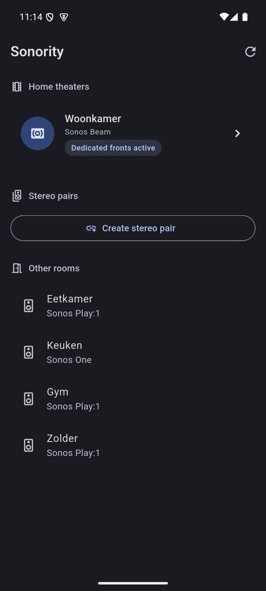

# Sonority

A clean, cross-platform (iOS + Android + macOS) Flutter app that unlocks Sonos speaker
configurations the official app refuses to create — **dedicated front left/right surround
speakers** on a home theater, and **stereo pairs of mismatched / app‑blocked speakers** (e.g.
a Sonos One paired with a Play:1) — via Sonos' undocumented local UPnP API. A focused,
better‑UX alternative to *SonoSequencr*.

## Screenshots

<p align="center">
  
  &nbsp;&nbsp;
  
  &nbsp;&nbsp;
  
</p>

## Install (prebuilt)

Grab the latest artifacts from [**Releases**](https://github.com/CasperVerswijvelt/Sonority/releases).

**Android — `Sonority-*.apk`** (release build, debug-signed)
- On your phone: download the APK, allow “install unknown apps” for your browser/files app, then open it.
- Or via adb: `adb install -r Sonority-*.apk`

**macOS — `Sonority-*-macos.zip`** (unsigned, not notarized)
- Unzip it, then strip the Gatekeeper quarantine flag — otherwise macOS reports the app is “damaged” / won’t open:
  ```sh
  xattr -r -d com.apple.quarantine Sonority.app
  ```
  If it’s in a protected location and that’s denied, use sudo:
  ```sh
  sudo xattr -r -d com.apple.quarantine Sonority.app
  ```
- Then open it (first launch: right-click → Open). Move it to `/Applications` if you like.

**iOS — `Sonority-*-ios-unsigned.ipa`** (unsigned; must be re-signed to install)
- Sideload with [AltStore](https://altstore.io) or [Sideloadly](https://sideloadly.io) using your Apple ID, or re-sign with your own provisioning profile.

> On every platform, keep the device on the **same Wi‑Fi** as your Sonos. iOS and macOS prompt for **local network** access on the first scan — allow it, or discovery finds nothing.

## How it works

Sonos players expose an undocumented **local UPnP/SOAP API** on port `1400`. Sonority does no
audio processing; it simply issues the bonding call the official app won't:

1. **Discovery** — SSDP `M-SEARCH` to `239.255.255.250:1900`, then each player's
   `http://<ip>:1400/xml/device_description.xml`. → `lib/data/sonos/ssdp_discovery.dart`,
   `device_description.dart`
2. **Topology** — `ZoneGroupTopology.GetZoneGroupState` for the full system layout.
   → `lib/data/sonos/zone_topology.dart`
3. **The unlock** — `DeviceProperties.AddHTSatellite` with a `HTSatChanMapSet` mapping the two
   chosen speakers to the front channels (`LF`/`RF`). `RemoveHTSatellite` undoes it.
   → `lib/data/sonos/device_properties.dart`, `channel_map.dart`

A restore point (the soundbar's current `HTSatChanMapSet`) is saved before every change.

## Project layout

```
lib/
  core/        result + theme
  data/        models + sonos/ (ssdp, descriptions, soap, topology, device props, channel map, repository)
  state/       Riverpod controller
  features/    discovery / home_theater / front_surrounds / widgets
tool/spike.dart  read-only hardware validation CLI
```

## Run

This repo uses [fvm](https://fvm.app) (Flutter 3.35.2). Replace `flutter` with
`fvm flutter` if you have fvm on PATH.

```bash
flutter pub get
flutter test          # unit tests (channel map, SOAP envelope, topology parsing)
flutter analyze
flutter run           # on a physical device on the same Wi-Fi as your Sonos
```

> Use a **physical** device — simulators/emulators can't reliably reach the LAN, and iOS 14+
> shows a one-time local-network permission prompt on first scan.

## Validate against your hardware first (read-only)

Before trusting any write, confirm the read path and capture the real channel-map string:

```bash
dart run tool/spike.dart
```

This discovers your system and prints every home theater's raw `HTSatChanMapSet`. The dedicated-front
recipe (soundbar stays `CC`, added speakers map to `LF`/`RF`, rears/sub preserved) is **confirmed on a
real Beam** and isolated in `buildDedicatedFrontsMap` (`lib/data/sonos/front_layout.dart`) — adjust
there if a different model/firmware ever needs it.

## Tools

- `tool/spike.dart` — read-only discovery + topology dump
- `tool/roundtrip.dart` — live AddHTSatellite/RemoveHTSatellite (dry-run by default; `--confirm`, `--apply-only`, `--remove-only`)
- `tool/stereopair.dart` — stereo-pair round-trip (create → verify → separate → restore names)
- `tool/chirp.dart` — play the identify chime on one speaker (validates `IdentifyService`)

## Status

- ✅ Discovery + home-theater topology UI (Material 3, dark mode)
- ✅ Dedicated front surrounds — guided add flow (+ Identify chime), one-tap remove
- ✅ Stereo pairs incl. mismatched models — create flow + separate with name restore
- ✅ Recipe confirmed on real hardware (Beam stays `CC`; fronts = `LF`/`RF`)
- ✅ CI release pipeline (APK + unsigned iOS/macOS) on `v*` tags

## Contributing / architecture

See **[CLAUDE.md](CLAUDE.md)** — the product principle (don't duplicate Sonos-app
features), the pure-Dart engine vs. UI split, the local UPnP API details, and the
critical gotchas (≈15s topology lag, poll-until-settled, authoritative channel-map
parsing, firmware-gated pairs, the macOS-sandbox chime limitation).
